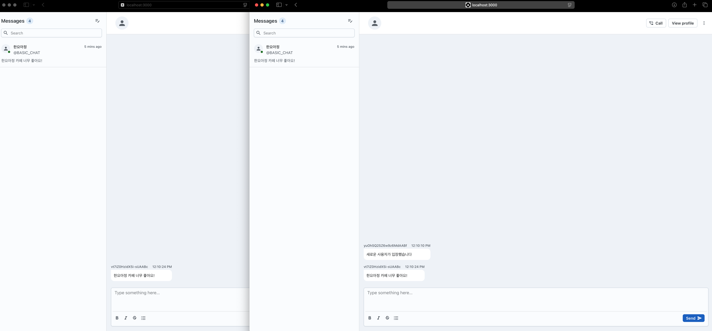

# 베이직 채팅방 - 채팅방 기능
## 과제 설명
> 실시간 채팅 애플리케이션 소켓 기능 구현
> 
> 룸을 만들어 채팅을 할 수 있는 채팅방을 만들어보세요. 

제공된 코드를 기반으로 실시간 채팅 애플리케이션의 소켓 기능을 구현하세요. 이 과제에서는 Socket.IO를 사용하여 사용자 간의 실시간 통신을 가능하게 만드는 것이 목표입니다.

---

## 요구 사항
요구 사항

주어진 코드를 바탕으로 아래 기능을 구현하세요.
1. 채팅방 입장 
- 사용자가 소켓을 통해 특정 채팅방에 입장할 수 있어야 합니다. 
- 방에 입장할 때, 해당 방의 모든 사용자에게 “새로운 사용자가 입장했습니다”라는 메시지가 방송되어야 합니다.

2. 메시지 전송 
- 사용자가 입력한 메시지를 해당 채팅방의 모든 사용자에게 전달해야 합니다. 
- 메시지에는 id, content, sender, timestamp 필드가 포함되어야 합니다.

3. 채팅방 나가기 
- 사용자가 방을 떠나면 해당 방의 모든 사용자에게 “사용자가 방을 떠났습니다”라는 메시지를 방송해야 합니다.

4. 추가 기능 (선택 사항)
- 메시지 저장 기능을 구현하여 채팅방에 입장하면 이전 메시지들을 볼 수 있게 해보세요. 
- 사용자 목록을 채팅방에 표시하는 기능을 추가해보세요.
---

## 소켓 명세
### JOIN_ROOM
설명: 사용자가 특정 채팅방에 입장할 때 호출됩니다.

데이터 구조
```json
{
  "room": "채팅방 이름"
}
```


### SEND_MESSAGE
설명: 메시지를 서버와 사용자가 주고 받을 때 호출됩니다.

**클라이언트 -> 서버 메시지 포멧**
```json
{
  "room": "채팅방 이름",
  "message": "보낼 메시지"
}
```

**서버 -> 클라이언트 메시지 포멧**
```json
{
  "id": "소켓 ID + 난수",
  "content": "전송된 메시지",
  "sender": "메시지 보낸 사용자",
  "timestamp": "메시지 전송 시각"
}
```

### LEAVE_ROOM
설명: 사용자가 채팅방을 떠날 때 호출됩니다.

```json
{
  "room": "채팅방 이름"
}
```

---

## 힌트
- socket.join(room)을 사용하여 사용자를 특정 방에 참여시킬 수 있습니다. 이때 room은 사용자가 참여할 방의 이름이며, 같은 이름의 방에 참여한 사용자끼리 메시지를 주고받을 수 있습니다.
- io.to(room).emit(event, data)를 사용하면 특정 방에 있는 사용자에게만 메시지를 전송할 수 있습니다.

---

## 예시 화면


## 제출 방법
- 소켓 기능이 완전히 구현된 서버 코드를 제출하세요.
- 추가로 구현한 기능이나 개선 사항이 있다면 설명해주세요.

